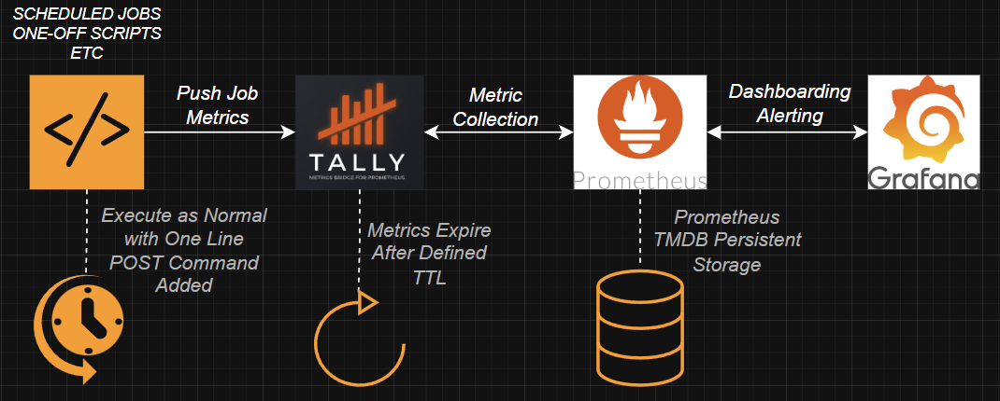
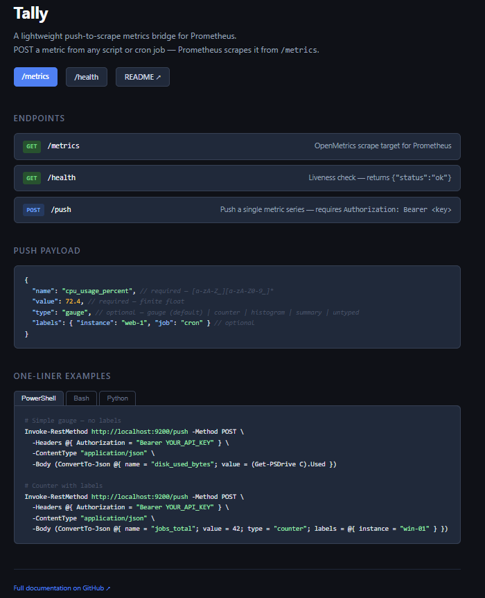

<p align="center"></p>

A lightweight push-to-scrape metrics bridge for Prometheus. When a cron job or script gets the job done, Tally gives you the observability — no custom exporters, no instrumentation libraries, no needlessly complicated APIs. Just a single HTTP POST.

**Status:** Active development

<p>
  
  
  
  
  
</p>

---

## Table of Contents

- [Why Tally](#why-tally)
- [How It Works](#how-it-works)
- [Quick Start](#quick-start)
- [Deployment](#deployment)
- [Configuration](#configuration)
- [Pushing a Metric](#pushing-a-metric)
- [API Reference](#api-reference)
- [Prometheus Integration](#prometheus-integration)
- [Grafana](#grafana)
- [Design Decisions](#design-decisions)

---

## Why Tally

Prometheus is pull-based. It scrapes exporters on a schedule. That works perfectly for long-running services — but it leaves a gap for everything else.

Most infrastructure has work that runs on a schedule: backup jobs, ETL pipelines, disk cleanup scripts, cron tasks, deploy hooks. When those jobs finish you want to know they ran, how long they took, and whether they succeeded. The standard options are:

- **Write a custom exporter** — overkill for a cron job that runs once a day
- **Use Pushgateway** — the official answer, but it comes with real operational problems
- **Just don't observe it** — the most common choice, and the wrong one

**Why not Pushgateway?** Pushgateway persists metrics indefinitely with no TTL. In HA Prometheus setups this causes duplicate scrapes and inconsistent results. The Prometheus team [explicitly warns](https://prometheus.io/docs/practices/pushing/) against using it for anything other than service-level batch jobs, and even then stale metrics after a pod restart or failed job will sit in your dashboards looking healthy until someone manually deletes them. Tally's TTL-based model means a job that stops running causes its metric to disappear naturally — the gap is visible, the alerting is honest, and there's nothing to clean up manually.

Tally is the missing middle option. Run it as a container alongside your stack. POST a metric when your job finishes. Prometheus scrapes `/metrics` and you get full observability with no new dependencies in your scripts.

---

## How It Works


> *How a script push flows through Tally into Prometheus and Grafana*

1. A script, cron job, or any process makes a single HTTP POST to `/push` with a JSON payload
2. Tally validates the input and stores the metric in memory with a timestamp
3. Prometheus scrapes `/metrics` on its normal schedule and receives the full metric set in OpenMetrics text format
4. Prometheus records the data point — **this is where persistence happens**
5. Metrics that haven't been updated within the TTL window are automatically expired and removed from Tally's output
6. Grafana queries Prometheus as normal — Tally is invisible to the dashboard layer

**Tally holds current state. Prometheus holds history.** Tally is a live staging area, not a database. Every data point Tally has ever served is already durably stored in Prometheus by the time it expires from Tally's memory.


> *The built-in landing page at `/` — endpoint reference and push examples without leaving the browser*

---

## Quick Start

**Prerequisites:** [Docker](https://docs.docker.com/get-docker/) with the Compose plugin installed.

---

**1. Create a directory and download the config files:**

```bash
mkdir tally && cd tally

# Download the compose file and env template
curl -O https://raw.githubusercontent.com/KDScheuer/Tally/main/docker-compose.yml
curl -O https://raw.githubusercontent.com/KDScheuer/Tally/main/.env.example
mv .env.example .env
```

See [docker-compose.yml](docker-compose.yml) and [.env.example](.env.example) for the full contents of these files.

---

**2. Set your API key in `.env`:**

The `API_KEY` is the password required to push metrics. It can be any string you choose. To generate a secure random one:

```bash
# Linux / macOS
openssl rand -hex 32
```

```powershell
# Windows (PowerShell)
-join ((1..32) | ForEach-Object { '{0:x}' -f (Get-Random -Max 256) })
```

Open `.env` and set the value:

```env
API_KEY=paste-your-key-here
```

---

**3. Pull the image and start the container:**

```bash
docker compose up -d
```

Verify it's running:

```bash
docker compose ps
curl http://localhost:9200/health
# {"status":"ok"}
```
> **Note:** This example pushes over plain HTTP on localhost. In production, `/push` should only be reachable through a TLS-terminating reverse proxy so the API key is not transmitted in plain text. See [Deployment](#deployment).

---

**4. Push your first metric:**

```bash
curl -X POST http://localhost:9200/push \
  -H "Authorization: Bearer your-api-key" \
  -H "Content-Type: application/json" \
  -d '{"name": "backup_last_run_seconds", "value": 142.5, "type": "gauge"}'
```


---

**5. Verify it appears in the scrape output:**

```bash
curl http://localhost:9200/metrics
```

---

**6. Open the UI:**

Navigate to `http://localhost:9200` in a browser for the full endpoint reference and one-liner examples in PowerShell, Bash, and Python.

---

## Deployment

Tally is designed to run behind a reverse proxy (Nginx, Caddy, Traefik, etc.). The reverse proxy handles TLS termination — Tally speaks plain HTTP internally and the proxy handles certificates and external exposure.

**Recommended setup:**

```
Internet → Reverse Proxy (TLS) → Tally (HTTP, internal only)
```

Bind Tally to `127.0.0.1` or an internal Docker network so it is never directly reachable from outside the host. The `API_KEY` stays internal to your network and is only transmitted over the TLS-terminated connection from the proxy.

**Example Caddy config:**

```caddy
tally.example.com {
    reverse_proxy localhost:9200
}
```

**Example Nginx config:**

```nginx
server {
    listen 443 ssl;
    server_name tally.example.com;

    location / {
        proxy_pass http://127.0.0.1:9200;
        proxy_set_header X-Real-IP $remote_addr;
    }
}
```

If you expose `/push` publicly, consider rate-limiting at the proxy layer. `/metrics` is intentionally unauthenticated so Prometheus can scrape it without additional config — if your Prometheus is on the same internal network as Tally, external exposure of `/metrics` is unnecessary.

---

## Configuration

All configuration is through environment variables. Only `API_KEY` is required.

| Variable | Default | Description |
|---|---|---|
| `API_KEY` | — | **Required.** Bearer token for the `/push` endpoint. |
| `PORT` | `9200` | Port the server listens on. |
| `BIND_ADDRESS` | `0.0.0.0` | IP address to bind to. `0.0.0.0` binds all interfaces inside Docker; Docker's port mapping controls external exposure. |
| `METRIC_TTL` | `1440` | Minutes before a metric series is expired and removed. Default is 24 hours. |
| `MAX_METRICS` | `1000` | Maximum number of series held in memory at once. New series are rejected with `429` when the limit is reached; updates to existing series always go through. |

---

## Pushing a Metric

**Required headers:**

| Header | Value |
|---|---|
| `Authorization` | `Bearer <API_KEY>` |
| `Content-Type` | `application/json` |

**Payload:**

```json
{
  "name":   "backup_duration_seconds",
  "value":  142.5,
  "type":   "gauge",
  "labels": {"host": "web-01", "job": "nightly-backup"}
}
```

`name` and `value` are required. `type` defaults to `gauge`. `labels` is optional. See [API Reference](#api-reference) for full field details.

```bash
curl -X POST http://localhost:9200/push \
  -H "Authorization: Bearer $API_KEY" \
  -H "Content-Type: application/json" \
  -d '{"name":"backup_duration_seconds","value":142.5,"labels":{"host":"web-01"}}'
```

### [Bash examples →](docs/examples/bash.md)

### [PowerShell examples →](docs/examples/powershell.md)

### [Python examples →](docs/examples/python.md)

---

## API Reference

### `GET /`
Landing page — UI with endpoint reference and usage examples.

### `GET /health`
Liveness check. Returns `{"status":"ok"}` with a `200`. Suitable for Docker health checks and load balancer probes.

```bash
curl http://localhost:9200/health
```

### `GET /metrics`
OpenMetrics scrape endpoint for Prometheus. Returns all stored series in text format, grouped by metric family with one `# TYPE` declaration per family, followed by `# EOF`.

Browsers receive `text/plain` so the output renders directly. Prometheus scrapers receive `application/openmetrics-text`.

### `POST /push`
Push a single metric series. Requires `Authorization: Bearer <API_KEY>` header.

**Request body:**

```json
{
  "name":   "backup_duration_seconds",
  "value":  142.5,
  "type":   "gauge",
  "labels": {
    "host": "web-01",
    "job":  "nightly-backup"
  }
}
```

| Field | Required | Description |
|---|---|---|
| `name` | Yes | Metric name. Must match `[a-zA-Z_][a-zA-Z0-9_]*`, max 200 chars. |
| `value` | Yes | Numeric value. Must be a finite float — `NaN` and `±Inf` are rejected. |
| `type` | No | One of `gauge`, `counter`, `histogram`, `summary`, `untyped`. Defaults to `gauge`. |
| `labels` | No | Key/value label set. Names must match `[a-zA-Z_][a-zA-Z0-9_]*` and must not start with `__`. |

**Histogram and summary** series must be pushed individually using the conventional suffixes. Each push is one series:

```bash
# Push histogram series one at a time
curl -X POST http://localhost:9200/push -H "Authorization: Bearer $KEY" \
  -d '{"name":"req_duration_bucket","value":5,"type":"histogram","labels":{"le":"0.1"}}'

curl -X POST http://localhost:9200/push -H "Authorization: Bearer $KEY" \
  -d '{"name":"req_duration_sum","value":2.53,"type":"histogram"}'

curl -X POST http://localhost:9200/push -H "Authorization: Bearer $KEY" \
  -d '{"name":"req_duration_count","value":12,"type":"histogram"}'
```

Tally strips the suffix (`_bucket`, `_sum`, `_count`, `_total`, `_created`, `_info`) to derive the family name and emits a single `# TYPE` line per family:

```
# TYPE req_duration histogram
req_duration_bucket{le="0.1"} 5
req_duration_count 12
req_duration_sum 2.53
# EOF
```

More examples: [Bash](docs/examples/bash.md) · [PowerShell](docs/examples/powershell.md) · [Python](docs/examples/python.md)

---

## Prometheus Integration

Add Tally as a scrape target in your `prometheus.yml`:

```yaml
scrape_configs:
  - job_name: tally
    static_configs:
      - targets: ["localhost:9200"]
```

Prometheus will scrape `/metrics` on its normal interval. The `tally_up` metric is always present — it equals `1` whenever Tally is running and serving. Use it as a health signal in dashboards:

```promql
tally_up{job="tally"}
```

---

## Grafana

Because Tally pushes to Prometheus and Prometheus feeds Grafana, no special Grafana integration is needed — query your metrics exactly as you would any other Prometheus source.

Useful patterns:

```promql
# Last time a job ran (unix timestamp as value)
backup_last_run_timestamp{host="web-01"}

# Time since last successful run
time() - backup_last_run_timestamp{host="web-01"}

# Alert if a job hasn't run in 25 hours
time() - backup_last_run_timestamp > 90000
```

---

## Design Decisions

**📤 Push model over pull**
Prometheus is pull-based by design — great for long-running services, wrong for ephemeral jobs. A cron job that runs at 2am and takes 3 minutes has finished before Prometheus could ever scrape it. Push is the right model for the sender, but rather than require Prometheus to change how it operates, Tally bridges the two: accept pushes, serve pulls. The rest of the observability stack — Prometheus, Grafana, alerting rules — stays exactly as-is.

**🔑 API key over no auth**
`/metrics` is intentionally unauthenticated — Prometheus scrapers generally can't send auth headers without extra config and the data is read-only. `/push` is authenticated because it's a write endpoint. A bearer token in the `Authorization` header is the simplest thing that actually works from `curl`, PowerShell, and Python without additional libraries.

**⏱ TTL-based expiry over manual deletion**
Metrics expire automatically after `METRIC_TTL` minutes if they aren't updated. This means a job that stops running causes its metric to disappear from `/metrics` naturally — Prometheus records the gap, Grafana shows it, and you don't need to manage cleanup. The alternative (keeping stale metrics forever, as Pushgateway does) makes dashboards actively misleading: a job that has been failing silently still shows its last successful value until someone notices and deletes it by hand.

**💾 In-memory storage by design**
All metrics are stored in memory. A container restart clears the store. This is intentional.

Persistence is Prometheus's job. It scrapes `/metrics` on a regular interval and durably stores every data point — with timestamps, history, retention policies, and compaction. By the time a metric expires from Tally's TTL window, Prometheus has already recorded every value it served. Nothing is lost.

Adding a persistence layer to Tally would mean two sources of truth that could disagree. It would also break the TTL model: a metric loaded from disk after a restart has no meaningful "last updated" time, so you can't know whether it's fresh data or a week-old stale value. You'd have to add versioned storage formats, crash recovery, and migration logic — at which point you've built Pushgateway.

If Tally restarts, jobs repopulate it on their next scheduled run. The gap is visible in Prometheus exactly as it should be.

**🔒 TLS at the reverse proxy layer**
Tally speaks plain HTTP. TLS termination belongs at the reverse proxy (Nginx, Caddy, Traefik) where certificate management, renewal, and cipher configuration are already handled. Embedding TLS into every internal service creates more certificate management overhead without improving the security boundary — the trust boundary is at the edge, not between internal components.

**🏷 Labels as first-class citizens**
Each unique combination of `name` + `labels` is a separate series with its own TTL clock. This means the same metric name can be pushed from multiple hosts or jobs and appear as distinct series in Prometheus — the same model Prometheus itself uses. Without labels, you'd need a unique metric name per host which doesn't scale.

**📦 Single static binary with embedded UI**
The HTML landing page is compiled into the binary via Go's `//go:embed`. The Docker image has no files to mount, no config directories, no web root — just the binary and a port. This makes the container trivially simple to run and impossible to misconfigure through file layout.

**🔒 Non-root container**
The Docker image runs as a dedicated `tally` user with no elevated privileges. Combined with binding to a non-privileged port (`9200`), there's no reason for the process to have any elevated permissions. The binary is statically compiled and the runtime image is minimal Alpine — the attack surface is as small as it can practically be.

---

## License

MIT
